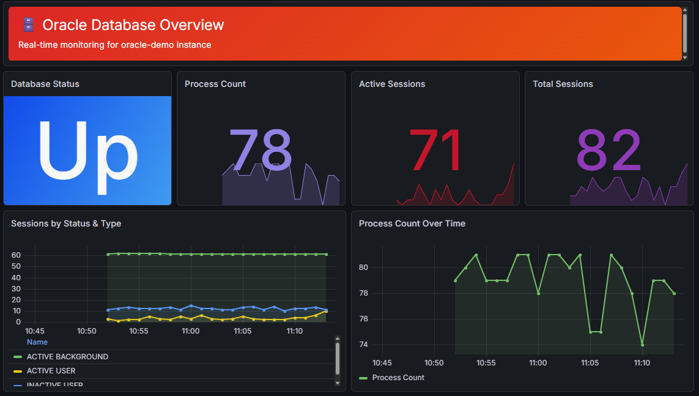
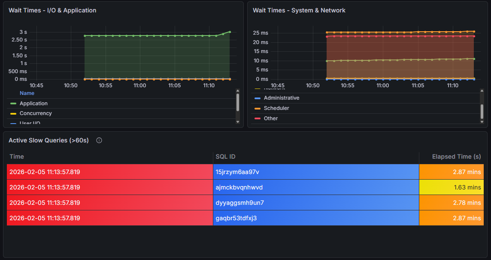
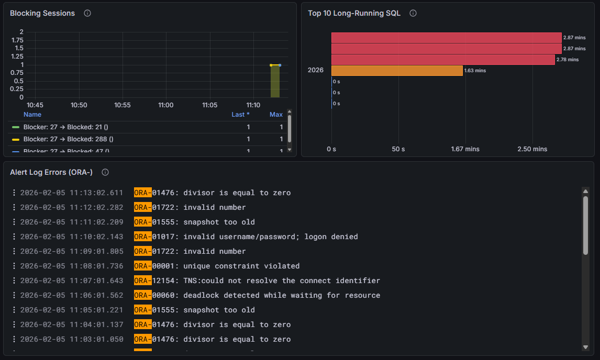

# Oracle Observability Demo for Grafana Cloud

<table>
  <tr>
    <td width="50%"></td>
    <td width="50%"></td>
  </tr>
  <tr>
    <td width="50%"></td>
    <td width="50%"></td>
  </tr>
</table>

A Docker-based demonstration showcasing **two methods** for collecting Oracle Database metrics and sending them to Grafana Cloud:

1. **Grafana Cloud Integration** - Native Alloy `prometheus.exporter.oracledb` component
2. **Oracle Official OTel Exporter** - Standalone exporter from Oracle Container Registry

This demo enables side-by-side comparison of both collection methods, each labeled with `collection_method` for easy filtering in Grafana Cloud.

## Quick Start (5 Minutes)

### Prerequisites

- **Docker Desktop** installed and running
- **4GB RAM minimum** allocated to Docker Desktop (Oracle XE requirement)
- **Grafana Cloud account** with a stack created
- **Prometheus metrics credentials** from Grafana Cloud

### Step 1: Clone and Configure

```bash
# Clone the repository
git clone <repo-url>
cd grafana-cloud-oracle-demo

# Copy environment template
cp .env.example .env

# Edit .env with your Grafana Cloud credentials
# Windows: notepad .env
# Mac/Linux: nano .env
```

### Step 2: Get Grafana Cloud Credentials

1. Go to https://grafana.com/orgs/YOUR_ORG/stacks
2. Click **Details** on your stack
3. Find the **Prometheus** section, click **Send Metrics**
4. Copy these values to your `.env` file:
   - `GRAFANA_METRICS_URL` (e.g., `https://prometheus-prod-XX-XXX.grafana.net/api/prom/push`)
   - `GRAFANA_METRICS_USERNAME` (numeric user ID)
   - `GRAFANA_METRICS_API_KEY` (generate a new API key with "Metrics Push" scope)
5. Find the **Loki** section, click **Send Logs**
6. Copy these values:
   - `GRAFANA_LOGS_URL`, `GRAFANA_LOGS_USERNAME`, `GRAFANA_LOGS_API_KEY`

Example `.env` file:
```env
# Oracle Database Configuration (leave as-is for demo)
ORACLE_PASSWORD=oracle

# Grafana Cloud Configuration (update with your values)
GRAFANA_METRICS_URL=https://prometheus-prod-13-prod-us-east-0.grafana.net/api/prom/push
GRAFANA_METRICS_USERNAME=123456
GRAFANA_METRICS_API_KEY=glc_xxxxxxxxxxxxxxxxxxxxxxxxxxxxx
GRAFANA_LOGS_URL=https://logs-prod-006.grafana.net/loki/api/v1/push
GRAFANA_LOGS_USERNAME=123456
GRAFANA_LOGS_API_KEY=glc_xxxxxxxxxxxxxxxxxxxxxxxxxxxxx
```

### Step 3: Start the Demo

```bash
# Using make (recommended)
make start

# Or manually
docker compose up -d

# Watch Oracle Database startup (takes 60-90 seconds)
docker compose logs -f oracle-db
# Wait for "DATABASE IS READY TO USE!" message, then press Ctrl+C

# Verify all services are running
docker compose ps
```

Expected output:
```
NAME                STATUS              PORTS
demo-oracle-db      Up (healthy)        0.0.0.0:1521->1521/tcp
demo-oracle-otel    Up (healthy)        0.0.0.0:19161->9161/tcp
demo-oracle-alloy          Up (healthy)        0.0.0.0:12345->12345/tcp
```

### Step 4: Import the Dashboard

1. In Grafana Cloud, go to **Dashboards** > **New** > **Import**
2. Click **Upload dashboard JSON file**
3. Select `dashboards/oracle-overview.json` from this repository
4. Click **Import**

The dashboard is pre-configured to show metrics from both collection methods with `instance="oracle-demo"` filter.

### Step 5: Run the Load Generator (Optional)

To generate realistic database activity for demos:

**Option 1: Single Command (Recommended for SEs)**

```bash
# Bash/Linux/Mac
docker exec demo-oracle-db sqlplus -S demo_user/oracle@XEPDB1 <<< "EXEC generate_load;"
```

```powershell
# PowerShell/Windows
echo "EXEC generate_load;" | docker exec -i demo-oracle-db sqlplus -S demo_user/oracle@XEPDB1
```

**Option 2: Interactive (for troubleshooting)**

```bash
# Connect to Oracle as demo_user
docker exec -it demo-oracle-db sqlplus demo_user/oracle@XEPDB1

# Execute the load generator (runs for ~16 minutes)
SQL> EXEC generate_load;
```

**What the load generator does:**
- Inserts 1000 records into sales and customers tables
- Performs SELECT and UPDATE operations
- Generates visible activity in all metrics
- Runs for approximately 16 minutes

### Step 6: Demo Features (Advanced)

This demo includes automated scripts for showcasing Oracle monitoring capabilities:

#### Create Blocking Sessions

To demonstrate lock contention monitoring:

```bash
# Create a 3-minute blocking session scenario (default)
docker exec demo-oracle-db bash /tmp/create_blocking.sh

# Or specify a custom duration in seconds
docker exec demo-oracle-db bash /tmp/create_blocking.sh 60
```

Verify in Grafana with query:
```promql
oracledb_blocking_sessions_value{instance="oracle-demo"}
```

The metric shows which sessions are blocked and by whom. The blocking automatically resolves after 3 minutes.

#### ORA- Error Stream

The demo automatically injects ORA- errors into the alert log every 60 seconds for log monitoring demonstration. Errors include realistic scenarios like:
- ORA-00942: table or view does not exist
- ORA-01476: divisor is equal to zero
- ORA-01722: invalid number
- ORA-00001: unique constraint violated

View errors in Grafana Loki with query:
```logql
{job="oracle/alert-log"} |~ "ORA-"
```

The `ora_error` label is automatically extracted (e.g., `ora_error="ORA-00942"`).

**To restart error injection manually:**
```bash
# Stop existing injection (if running)
docker exec demo-oracle-db pkill -f inject_ora_errors

# Start error injection
docker exec -d demo-oracle-db bash /tmp/inject_ora_errors.sh
```

## Running Tests

```bash
# Run all tests
make test

# Run individual test suites
make test-preflight    # Prerequisites check
make test-smoke        # Containers running and healthy
make test-telemetry    # Metrics/logs flowing to Grafana Cloud

# Run k6 load test (tests the Alloy pipeline)
make load-test
```

## Architecture

```
┌─────────────────────────────────────────────────────────────────┐
│                        Docker Environment                       │
│                                                                 │
│  ┌──────────────────┐         ┌─────────────────────────────┐   │
│  │  Oracle XE DB    │◄────────│  Oracle OTel Exporter       │   │
│  │  Port: 1521      │         │  Port: 19161                │   │
│  │                  │         │  Exposes: /metrics          │   │
│  └────────┬─────────┘         └───────────┬─────────────────┘   │
│           │                               │                     │
│           │         ┌─────────────────────▼──────────────────┐  │
│           └────────►│  Grafana Alloy v1.8.2                  │  │
│                     │  - Built-in oracledb exporter (→ DB)   │  │
│                     │  - Scrapes OTel Exporter (→ :19161)    │  │
│                     │  - Labels each with collection_method  │  │
│                     │  - Remote writes to Grafana Cloud      │  │
│                     └─────────────────────┬──────────────────┘  │
│                                           │                     │
└───────────────────────────────────────────┼─────────────────────┘
                                            │
                                            ▼
                                ┌────────────────────┐
                                │  Grafana Cloud     │
                                │  Prometheus        │
                                └────────────────────┘
```

## What's Being Collected

### Metrics Available from Both Sources

| Metric | Description | Use Case |
|--------|-------------|----------|
| `oracledb_up` | Database availability (1=up, 0=down) | Uptime monitoring |
| `oracledb_sessions_value` | Active/inactive sessions by type | Connection pool monitoring |
| `oracledb_process_count` | Total process count | Resource usage |
| `oracledb_activity_execute_count` | SQL executions | Query load |
| `oracledb_activity_user_commits` | User commits | Transaction rate |
| `oracledb_tablespace_*` | Tablespace usage metrics | Storage monitoring |

### Additional Metrics (Oracle OTel Exporter Only)

| Metric | Description |
|--------|-------------|
| `oracledb_wait_time_*` | Wait times by category (user_io, system_io, network, etc.) |
| `oracledb_db_system_value` | System parameters (CPU count, SGA, PGA) |
| `oracledb_top_sql_elapsed` | Top SQL query elapsed time |

All metrics include the `collection_method` label for easy comparison:
- `collection_method="integration"` - Alloy's native exporter
- `collection_method="otel_exporter"` - Oracle's official exporter

## Viewing Data in Grafana Cloud

### Using the Included Dashboard

The included `dashboards/oracle-overview.json` provides:
- **Database Status** - Uptime and availability
- **Sessions & Processes** - Connection and resource monitoring
- **Activity Metrics** - SQL executions, commits, parses
- **Tablespace Usage** - Storage capacity and utilization
- **Wait Time Analysis** - I/O and system wait events
- **Collection Method Comparison** - Side-by-side visualization

### Sample PromQL Queries

**Compare both collection methods:**
```promql
oracledb_up{instance="oracle-demo"}
```

**Active user sessions:**
```promql
# Alloy Integration
oracledb_sessions_value{collection_method="integration", type="USER", status="ACTIVE"}

# Oracle OTel Exporter
oracledb_sessions_value{collection_method="otel_exporter", type="USER", status="ACTIVE"}
```

**SQL execution rate:**
```promql
rate(oracledb_activity_execute_count{instance="oracle-demo"}[5m])
```

**Tablespace usage:**
```promql
oracledb_tablespace_used_percent{instance="oracle-demo"}
```

**Wait time breakdown (OTel only):**
```promql
{__name__=~"oracledb_wait_time_.*", collection_method="otel_exporter"}
```

## Verification Steps

### 1. Check Container Health
```bash
docker compose ps
# All should show "Up (healthy)"
```

### 2. Check Alloy UI
```
http://localhost:12345
```
- Navigate to **Components** tab
- Verify `prometheus.exporter.oracledb.integration` is healthy
- Verify `prometheus.scrape.otel_exporter` is healthy
- Check that both are forwarding metrics to `prometheus.remote_write.grafana_cloud`

### 3. Check Oracle OTel Exporter Metrics
```bash
curl http://localhost:19161/metrics | grep oracledb_up
# Should show: oracledb_up{database="default"} 1
```

### 4. Check Grafana Cloud
- Go to your Grafana Cloud instance > **Explore**
- Run query: `oracledb_up{instance="oracle-demo"}`
- You should see 2 time series with different `collection_method` labels

### 5. Verify Metrics Are Flowing
```bash
# Check Alloy metrics sent to Grafana Cloud
curl -s http://localhost:12345/metrics | grep "prometheus_remote_storage_samples_total"
# Should show increasing count
```

## Troubleshooting

### Oracle Database Not Starting

**Symptom:** Container exits or restarts repeatedly

**Solution:**
```bash
# Check logs
docker compose logs oracle-db

# Common issue: Insufficient memory
# Ensure Docker Desktop has at least 4GB RAM allocated
# Docker Desktop > Settings > Resources > Memory

# If stuck, restart the container
docker compose restart oracle-db
```

### Alloy Cannot Connect to Oracle

**Symptom:** `prometheus.exporter.oracledb.integration` shows errors in Alloy UI

**Solution:**
```bash
# Check Alloy logs
docker compose logs demo-oracle-alloy | grep -i error

# Verify Oracle is healthy
docker compose ps oracle-db
# Should show "Up (healthy)"

# Check database connectivity
docker exec -it demo-oracle-db sqlplus grafanau/oracle@XEPDB1
SQL> SELECT 1 FROM DUAL;
SQL> EXIT;
```

### No Metrics in Grafana Cloud

**Symptom:** Queries return no data in Grafana Cloud Explore

**Solution:**
```bash
# 1. Verify credentials in .env
cat .env | grep GRAFANA_METRICS

# 2. Check Alloy UI at http://localhost:12345
#    Look for prometheus.remote_write.grafana_cloud component
#    Verify "Samples Sent" is increasing

# 3. Restart Alloy to pick up new credentials
docker compose restart alloy

# 4. Wait 1-2 minutes for metrics to appear in Grafana Cloud
```

### Oracle OTel Exporter Connection Issues

**Symptom:** Exporter shows `oracledb_up 0` or connection errors

**Solution:**
```bash
# Check exporter logs
docker compose logs oracle-otel-exporter

# Verify config file
docker exec demo-oracle-otel cat /config.yaml

# Ensure Oracle is healthy before exporter starts
docker compose restart oracle-otel-exporter
```

### Load Generator Issues

**Symptom:** `ORA-04021: timeout occurred while waiting to lock object`

**Solution:**
```sql
-- This means load generator is already running
-- Wait for it to finish or kill the session:

-- Find the session
SELECT sid, serial#, status FROM v$session
WHERE username = 'DEMO_USER' AND status = 'ACTIVE';

-- Kill the session (replace SID and SERIAL#)
ALTER SYSTEM KILL SESSION 'SID,SERIAL#';
```

### Port Conflicts on Windows

**Symptom:** `bind: An attempt was made to access a socket in a way forbidden by its access permissions`

**Solution:**
```bash
# Check Windows reserved ports
netsh interface ipv4 show excludedportrange protocol=tcp

# If port 19161 is reserved, edit docker-compose.yml
# Change the port mapping from "19161:9161" to a different port like "19162:9161"
```

## Configuration Details

### Database Users

| User | Password | Purpose | Connection String |
|------|----------|---------|-------------------|
| `SYSTEM` | `oracle` | Admin (auto-created) | `SYSTEM/oracle@XEPDB1` |
| `grafanau` | `oracle` | Metrics collection (both exporters) | `grafanau/oracle@XEPDB1` |
| `demo_user` | `oracle` | Load generator schema | `demo_user/oracle@XEPDB1` |

### Ports

| Service | Host Port | Container Port | Purpose |
|---------|-----------|----------------|---------|
| Oracle DB | 1521 | 1521 | Database connections |
| Oracle OTel Exporter | 19161 | 9161 | Prometheus metrics endpoint |
| Grafana Alloy | 12345 | 12345 | Alloy UI and metrics |

### Why Not Alloy Alone?

This demo uses **Grafana Alloy v1.8.2** and a separate Oracle OTel Exporter container rather than relying solely on Alloy's built-in `prometheus.exporter.oracledb`. There are two reasons:

1. **Custom metrics are not yet supported in Alloy's built-in exporter.** The `custom_metrics` argument was added in v1.3.0 but remains non-functional due to an outdated internal dependency. This means Alloy can't run custom SQL queries for things like blocking sessions, slow queries, or long transactions. See [grafana/alloy#419](https://github.com/grafana/alloy/issues/419).

2. **Alloy v1.9.0+ requires Oracle Instant Client**, which is not bundled in the stock `grafana/alloy` Docker image. Starting with v1.9.0, Alloy switched its internal exporter from the unmaintained [iamseth/oracledb_exporter](https://github.com/iamseth/oracledb_exporter) to [oracle/oracle-db-appdev-monitoring](https://github.com/oracle/oracle-db-appdev-monitoring), which requires the Oracle client libraries. Until these are bundled in the image, upgrading past v1.8.2 breaks the built-in exporter for Docker-based deployments. See [grafana/alloy#4153](https://github.com/grafana/alloy/issues/4153).

The separate Oracle OTel Exporter container sidesteps both issues: it ships with its own Oracle client and fully supports custom metrics via TOML configuration.

### Oracle OTel Exporter Configuration

The exporter uses a YAML config file (`exporter/config.yaml`):

```yaml
databases:
  default:
    username: grafanau
    password: oracle
    url: demo-oracle-db:1521/XEPDB1
    queryTimeout: 5
```

**Key detail:** The URL format is `host:port/service_name` (no `oracle://` prefix in config file).

## Demo Talking Points

Use this demo to showcase:

1. **Flexibility**: Grafana Cloud supports both its native integration AND vendor-specific exporters
2. **Easy Comparison**: Use `collection_method` label to compare metrics from both sources side-by-side
3. **No Lock-in**: Organizations can use Oracle's official tooling while still benefiting from Grafana Cloud's unified observability platform
4. **Real-time Observability**: Live metrics updating every 60 seconds, not just batch reporting
5. **Simple Deployment**: One `make start` command to run entire stack locally
6. **Production Ready**: Both exporters are actively maintained and used in production environments

### Demo Flow Suggestion

1. **Show the architecture** - Explain dual collection approach
2. **Show idle state** - Point out baseline metrics (2-3 active sessions, low CPU)
3. **Run load generator** - `EXEC generate_load;` in SQL*Plus
4. **Watch metrics change** in real-time:
   - Active sessions spike from 2-3 > 5-7
   - SQL execution rate increases
   - Wait events accumulate (visible in OTel exporter)
   - Commits increment steadily
5. **Compare both methods** - Use `collection_method` filter to show identical data from different sources
6. **Highlight unique OTel metrics** - Wait time analysis only available from Oracle's exporter

## Cleanup

```bash
# Stop all services (recommended)
make stop

# Or manually
docker compose down

# Stop and remove volumes (completely resets database)
docker compose down -v

# Full cleanup (containers, volumes, networks)
make clean
```

## Advanced Usage

### Custom Metrics in OTel Exporter

To add custom SQL queries as metrics:

1. Create a custom metrics file (e.g., `exporter/custom-metrics.toml`)
2. Update `exporter/config.yaml`:
   ```yaml
   databases:
     default:
       username: grafanau
       password: oracle
       url: demo-oracle-db:1521/XEPDB1
       queryTimeout: 5
       customMetrics: /custom-metrics.toml
   ```
3. Mount the file in `docker-compose.yml`:
   ```yaml
   volumes:
     - ./exporter/config.yaml:/config.yaml
     - ./exporter/custom-metrics.toml:/custom-metrics.toml
   ```

See [Oracle Observability Exporter documentation](https://oracle.github.io/oracle-db-appdev-monitoring/) for metric definition syntax.

### Adding Alert Logs to Loki

To send Oracle alert logs to Grafana Cloud Loki, update `alloy/config.alloy` with a Loki source and ensure you have Loki credentials configured. See Grafana Alloy documentation for `loki.source.file` component usage.

## Repository Structure

```
grafana-cloud-oracle-demo/
├── CLAUDE.md                    # Demo Builder methodology guide
├── Makefile                     # Task runner (make start, make test, etc.)
├── docker-compose.yml           # Orchestrates all services
├── .env.example                 # Template for environment variables
├── .gitignore                   # Exclude .env and sensitive files
├── alloy/
│   └── config.alloy             # Alloy configuration with both collection methods
├── exporter/
│   ├── config.yaml              # Oracle OTel Exporter configuration
│   └── custom-metrics.toml      # Custom SQL queries for additional metrics
├── oracle-init/
│   ├── init.sql                 # DB initialization, user creation, load generator
│   └── create_blocking.sh       # Lock contention demo script
├── scripts/
│   ├── preflight-check.sh       # Verify prerequisites
│   ├── start-demo.sh            # Start workflow
│   └── stop-demo.sh             # Stop workflow
├── tests/
│   ├── README.md                # Testing methodology
│   ├── preflight.bats           # Prerequisites tests
│   ├── smoke.bats               # Service health tests
│   └── telemetry.bats           # Data flow tests
├── k6/
│   ├── README.md                # Load testing documentation
│   └── load-test.js             # k6 pipeline verification
├── terraform/                   # Cloud infrastructure stubs (optional)
├── dashboards/
│   ├── README.md                # Dashboard import/export workflow
│   └── oracle-overview.json     # Pre-built Grafana dashboard
└── README.md                    # This file
```

## Technical Details

### Metrics Collection Flow

1. **Oracle Database** exposes data through system views (v$session, v$sysstat, etc.)
2. **Grafana Alloy** has a built-in exporter that queries these views directly using the Oracle driver
3. **Oracle OTel Exporter** also queries these views and exposes metrics at `:9161/metrics`
4. **Alloy scrapes** the OTel Exporter endpoint every 60 seconds
5. **Alloy relabels** each metric with `collection_method` to distinguish sources
6. **Alloy remote writes** all metrics to Grafana Cloud Prometheus
7. **Grafana dashboards** query Prometheus and visualize the data

### Why Two Collection Methods?

- **Native Integration (Alloy v1.8.2)**:
  - Lightweight, no additional containers
  - Part of Grafana's observability stack
  - Easy to configure and maintain
  - Limited to built-in metrics (no custom SQL queries yet — see [grafana/alloy#419](https://github.com/grafana/alloy/issues/419))

- **Oracle OTel Exporter**:
  - Official Oracle-supported tool
  - Supports custom metrics via TOML (blocking sessions, slow queries, etc.)
  - More comprehensive built-in metrics (wait times, top SQL)
  - Familiar to Oracle DBAs
  - Can be used independently of Grafana

This demo runs both side-by-side, giving organizations choice and flexibility. When Alloy resolves the Oracle Instant Client bundling ([grafana/alloy#4153](https://github.com/grafana/alloy/issues/4153)) and custom metrics support, consolidation to a single Alloy container may be possible.

## Resources

- [Grafana Alloy Documentation](https://grafana.com/docs/alloy)
- [prometheus.exporter.oracledb Component](https://grafana.com/docs/alloy/latest/reference/components/prometheus/prometheus.exporter.oracledb/)
- [Oracle Database Observability Exporter](https://oracle.github.io/oracle-db-appdev-monitoring/)
- [Oracle Database Exporter GitHub](https://github.com/oracle/oracle-db-appdev-monitoring)
- [Grafana Cloud Free Tier](https://grafana.com/products/cloud/)

## License

This demo is provided as-is for Grafana Sales Engineers and customers. Oracle Database XE is licensed under Oracle's Free Use Terms and Conditions.

## Support

For questions about this demo:
- **Grafana Alloy**: [Grafana Community Slack](https://slack.grafana.com/)
- **Oracle Exporter**: [GitHub Issues](https://github.com/oracle/oracle-db-appdev-monitoring/issues)
- **Oracle Database XE**: [Oracle Documentation](https://docs.oracle.com/en/database/oracle/oracle-database/21/xeinl/)

---

**Built for Grafana Sales Engineers**
